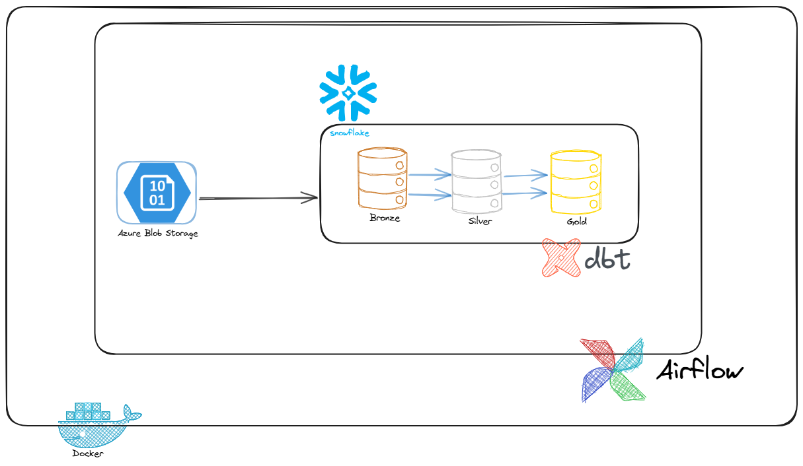
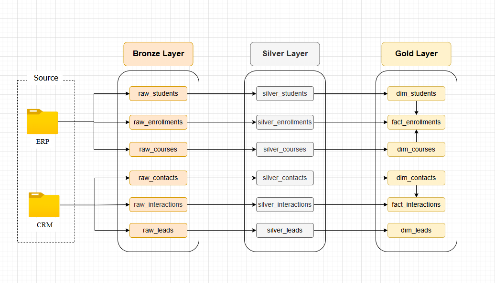
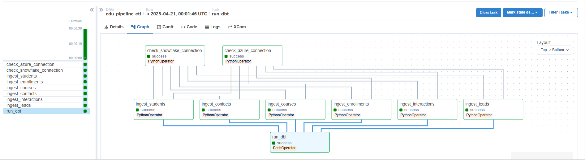
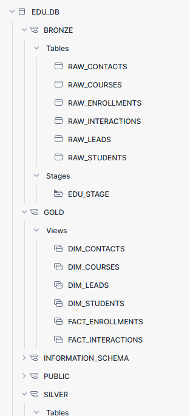

# Projet Data Engineering - Education Pipeline

Ce projet de **Data Engineering** est appliqué au domaine de l'éducation. 

L'objectif est de mettre en place un **pipeline de traitement de données** complet qui permet d'ingérer, transformer, et modéliser des données issues de différentes sources (ERP et CRM) afin de produire des données prêtes à l'analyse.

Le projet suit une architecture classique en **trois niveaux** :
- **Bronze** : ingestion brute des données.
- **Silver** : nettoyage et standardisation des données.
- **Gold** : modélisation finale des données pour les analyses.

Cette démarche permet de garantir la **qualité et la fiabilité des données**, tout en assurant une traçabilité entre les différentes étapes du traitement.

### Technologies utilisées

| Composant               | Technologie              |
|-------------------------|--------------------------|
| Orchestration           | Apache Airflow           |
| Stockage et entrepôt   | Snowflake                |
| Transformation          | DBT (Data Build Tool)    |
| Stockage source         | Azure Blob Storage (CSV) |
| Conteneurisation        | Docker                   |

Ce projet met en avant des compétences clés en **data engineering** :
- Mise en place d'un **pipeline orchestré**.
- Gestion de la **qualité des données**.
- Intégration de diverses technologies modernes.

Il est destiné à démontrer une approche professionnelle pour le traitement des données dans un contexte réaliste.

---

# 1. Architecture du pipeline

Le pipeline de ce projet suit l'approche **bronze / silver / gold** :

- **Bronze** : ingestion brute des données depuis les fichiers CSV stockés sur **Azure Blob Storage** vers **Snowflake**. Ces données ne subissent aucun traitement à ce stade.
- **Silver** : transformation et nettoyage des données brutes avec **DBT**. Les tables silver contiennent des données standardisées, nettoyées, prêtes pour les modélisations analytiques.
- **Gold** : modélisation finale sous forme de tables **dimensionnelles** et **factuelles**, prêtes pour des analyses ou visualisations.

Cette architecture permet de :
- Conserver l'historique brut des données (**bronze**).
- Appliquer des règles de nettoyage et de validation (**silver**).
- Fournir des données fiables pour les analyses (**gold**).

### Schéma du pipeline

Ce schéma illustre le flux complet :
- Les données sont extraites de **Azure Blob Storage**.
- Ingestion dans **Snowflake** au niveau **bronze**.
- Transformations par **DBT** pour passer au **silver** et **gold**.
- Orchestration assurée par **Apache Airflow** via des conteneurs **Docker**.

Le schéma ci-dessous détaille les tables à chaque niveau du pipeline (**bronze / silver / gold**) :

---

# 2. Sources de données

Le pipeline traite des données issues de deux systèmes principaux :

- **ERP** (Enterprise Resource Planning) :
  - `students.csv` : Contient les étudiants inscrits à l’école : identifiants, prénoms, noms, dates de naissance, dates d’inscription, emails.
  - `enrollments.csv` : Liste des inscriptions des étudiants aux cours : quel étudiant est inscrit à quel cours, à quelle date, et avec quel statut (actif, terminé, abandonné).
  - `courses.csv` : Informations sur les cours proposés : identifiant du cours, nom du cours (ex : Mathématiques), nombre de crédits, dates de début et fin.

- **CRM** (Customer Relationship Management) :
  - `contacts.csv` : Contient les contacts CRM (prospects, étudiants potentiels, anciens élèves) : identifiants, noms, prénoms, numéros de téléphone, emails, date de création.
  - `interactions.csv` : Historique des interactions CRM avec les contacts : appels, emails, rendez-vous, avec dates et types d’interactions.
  - `leads.csv` : Liste des leads CRM (personnes ou entreprises intéressées) : identifiants, nom complet, source du lead (web, referral…), statut du lead (new, contacted, etc.), date de création.

### Localisation des données

Tous les fichiers CSV sont stockés dans **Azure Blob Storage**, organisés en deux répertoires principaux :
- `ERP/` : contient les fichiers `students.csv`, `enrollments.csv`, `courses.csv`.
- `CRM/` : contient les fichiers `contacts.csv`, `leads.csv`, `interactions.csv`.

Ces fichiers sont la source d'ingestion du pipeline, traités via **Airflow** pour être intégrés dans **Snowflake** au niveau **bronze**.

---
# 3. Ingestion des données (Bronze)

L'étape d'ingestion permet de charger les données brutes des fichiers CSV stockés dans **Azure Blob Storage** vers **Snowflake**, au sein du schéma **BRONZE**. Cette ingestion est orchestrée par **Apache Airflow**.

### Fonctionnement de l'ingestion

- **Orchestration avec Airflow** :
  - Le pipeline est défini dans le fichier `edu_pipeline_etl.py`.
  - Chaque fichier CSV est ingéré via une tâche spécifique (étudiants, cours, inscriptions, contacts, leads, interactions).
  - Les connexions à **Azure** et **Snowflake** sont validées avant toute ingestion.

- **Connexion à Azure Blob Storage** :
  - La bibliothèque `adlfs` est utilisée pour se connecter à Azure Blob Storage via un **SAS Token**.
  - Les fichiers sont lus directement depuis le conteneur Blob et enregistrés temporairement en local pour le chargement.

- **Chargement dans Snowflake** :
  - Connexion à **Snowflake** via le connecteur Python `snowflake-connector`.
  - Création des tables **RAW_*** si elles n'existent pas, avec tous les champs en type `TEXT`.
  - Utilisation du stage `EDU_STAGE` pour transférer les fichiers depuis le local vers Snowflake.
  - Commande **COPY INTO** exécutée pour charger les données dans les tables **BRONZE**.

### Détail technique du DAG Airflow

- **Fichier** : `edu_pipeline_etl.py`
- **Tâches principales** :
  - `check_azure_connection` : vérifie la connexion et l'accessibilité des fichiers sur Azure Blob Storage.
  - `check_snowflake_connection` : valide l'accès à Snowflake et récupère les informations de l'utilisateur.
  - `ingest_table` : pour chaque entité (students, courses, enrollments, contacts, leads, interactions), une tâche ingère les données dans la table correspondante **RAW_table** .
  - `run_dbt` : lance le processus de transformation DBT une fois l'ingestion terminée.

- **Flux de dépendances** :
  - Les vérifications de connexion (à Azure et Snowflake) doivent réussir avant d'exécuter les ingestions.
  - Toutes les ingestions doivent être terminées avant de lancer **DBT**.
### Remarque: 
**Connexion à Azure Blob Storage**
L'ingestion commence par la connexion à **Azure Blob Storage**, où sont stockés les fichiers CSV.

- Un **SAS Token** (Shared Access Signature) a été généré depuis Azure Blob Storage pour permettre un accès sécurisé aux fichiers.
- Ce token, ainsi que les informations du compte et du conteneur, sont passés sous forme de **variables d'environnement** dans Airflow.
**Intégration de DBT dans Airflow**
- Le projet **DBT** est exécuté depuis **Airflow** via un `BashOperator` qui lance la commande `dbt run`.
- Pour permettre l'exécution de DBT dans le conteneur **Airflow**, il est nécessaire de **monter le dossier du projet DBT** dans le conteneur avec Docker :
<pre>
volumes:
  - ../edu_dbt:/opt/airflow/edu_dbt
</pre>
- Le fichier `profiles.yml` est indispensable pour que DBT puisse se connecter à Snowflake. Il doit être placé dans un sous-dossier appelé profiles à l'intérieur du projet DBT monté.

### Exemple de visualisation du DAG

Ce graphique montre les dépendances entre les tâches du pipeline :
- Connexions validées (Azure, Snowflake).
- Ingestions parallèles des différents fichiers CSV.
- Lancement de **DBT** une fois l'ingestion complète.
---
# 4. Transformation des données (Silver)

Après l'ingestion des données brutes dans **Snowflake** (niveau bronze), les données subissent une série de transformations pour être nettoyées et standardisées dans les **tables silver**. Ces transformations sont réalisées avec **DBT (Data Build Tool)**.

### Objectifs des transformations silver :
- Nettoyer les données issues des tables RAW.
- Standardiser les formats (dates, statuts, emails).
- Garantir la qualité des données grâce à des tests automatiques DBT.

### Tables silver produites :
- `silver_students`
- `silver_courses`
- `silver_enrollments`
- `silver_contacts`
- `silver_leads`
- `silver_interactions`
- Chaque transformation est définie dans des fichiers SQL DBT, et la qualité est vérifiée via le fichier `schema.yml` associé.
---
# 5. Modélisation finale (Gold)

Une fois les données nettoyées dans les tables **silver**, la dernière étape consiste à construire les **modèles analytiques** dans les tables **gold**. Ces modèles permettent d'alimenter des analyses et des tableaux de bord avec des données fiables et consolidées.

### Types de modèles produits :

- **Tables dimensionnelles** (structure descriptive) :
  - `dim_students`
  - `dim_courses`
  - `dim_contacts`
  - `dim_leads`

- **Tables factuelles** (structure transactionnelle) :
  - `fact_enrollments`
  - `fact_interactions`

Ces tables sont construites avec **DBT** à partir des tables **silver**.

### État des tables après les transformations gold

Une fois les modèles créés, les schémas **gold** contiennent les tables prêtes pour l'analyse :

### Gestion des clés primaires

Dans certains cas, les données sources ne disposent pas de **clés primaires naturelles fiables ou stables**.

Pour garantir **l'intégrité** et **la connexion entre les tables** du modèle analytique, des **clés substitut** (*surrogate keys*) sont générées dans les dimensions.

Ces clés **n'ont aucune signification fonctionnelle** ; elles sont uniquement utilisées pour assurer les **relations entre tables** (entre dimensions et faits).

Dans ce projet, les **surrogate keys** sont générées avec la fonction `row_number() over (order by ...)` :

- Cette méthode attribue un **numéro séquentiel unique** à chaque enregistrement.

#### Exemple :
Dans `dim_students`, la colonne **student_key** est générée ainsi :

`row_number() over (order by student_id)`

---

# 6. Conclusion

Ce projet met en œuvre un pipeline complet de **data engineering** basé sur une architecture **bronze / silver / gold**, avec une intégration et une transformation des données assurées de bout en bout.

### Compétences démontrées :

- **Orchestration** avec **Apache Airflow** pour automatiser l'ensemble du flux de traitement des données.
- **Intégration de données** dans **Snowflake**, un entrepôt de données cloud scalable.
- **Transformation des données** et **contrôle de la qualité** avec **DBT**, en appliquant des tests systématiques.
- Connexion à **Azure Blob Storage** pour l'ingestion de données brutes stockées sous format CSV.

Ce projet a pour but principal de **montrer mes compétences en data engineering**, à travers un cas concret d'intégration, de nettoyage, de modélisation et d'orchestration de données. Il sert de **démonstration technique** pour illustrer une architecture moderne et scalable de traitement de données.

